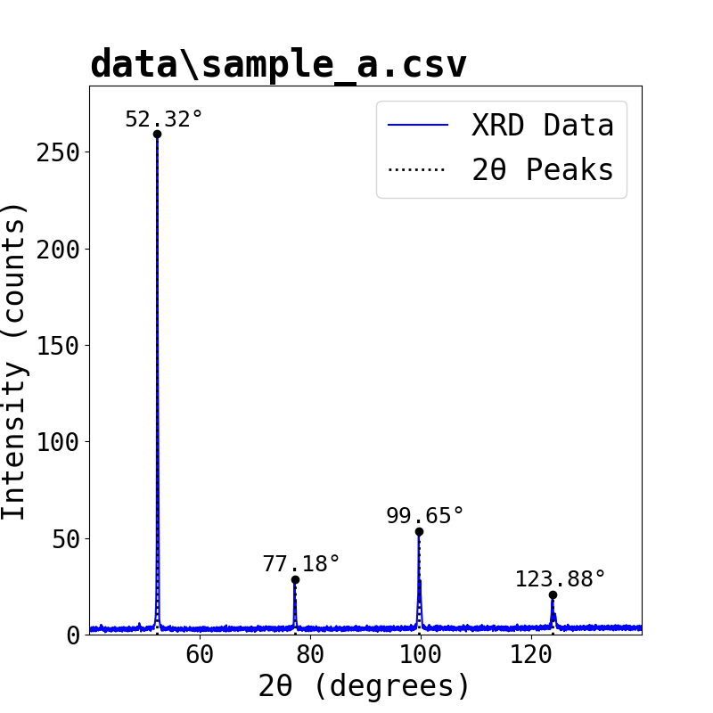

# SCCA (Single Crystal Cubic Analysis)
A tool for determining lattice constants of single crystal cubic structures.
This project was created to automate the data analysis of Powder XRD sample
data for an assessment.

## Setup
For more specific info: https://docs.python.org/3/library/venv.html

venv (Python Virtual Environment) ensures that packages required for a project
are installed inside of a virtual environment rather than placing random files
/packages all over your system.

## Building
Open cmd (terminal) and cd into the project directory.
### Windows
In cmd run the following commands:
1. run `.\setup_environment.bat` (setup environment)
2. run `.\environment\Scripts\activate.bat` (enter environment)

### Mac & Linux
1. run `./setup_environment.sh` (setup environment)
2. run `./environment/bin/activate` (enter environment)

## Running
Open cmd (terminal) and cd into the project directory.
### All Operating Systems
1. Make sure you have activated the venv.
2. run `python main.py [xrd_data.path] [wavelength] [normal_multiplier]`

## Further Info
- Graphs are placed and XRD data is placed in the `data` folder.

## Showcase
```
python main.py data\sample_a.csv 1.78897 2
data\sample_a.csv
+--------+----------+-------------+-------+----------+-------+---------+-----------+-------+
| Peak # | 2θ (Deg) | Intensities | d (Å) | sin^2(θ) | ratio | integer | hkl       | a (Å) |
+--------+----------+-------------+-------+----------+-------+---------+-----------+-------+
| 1      | 52.32    | 259.271     | 2.03  | 0.19     | 1.00  | 2       | (1, 1, 0) | 2.87  |
| 2      | 77.18    | 28.75       | 1.43  | 0.39     | 2.00  | 4       | (2, 0, 0) | 2.87  |
| 3      | 99.65    | 53.75       | 1.17  | 0.58     | 3.00  | 6       | (2, 1, 1) | 2.87  |
| 4      | 123.88   | 20.729      | 1.01  | 0.78     | 4.01  | 8       | (2, 2, 0) | 2.87  |
+--------+----------+-------------+-------+----------+-------+---------+-----------+-------+
Average Lattice Constant: 2.87 Å

saving figure: 'data\sample_a.csv.png'...
```
